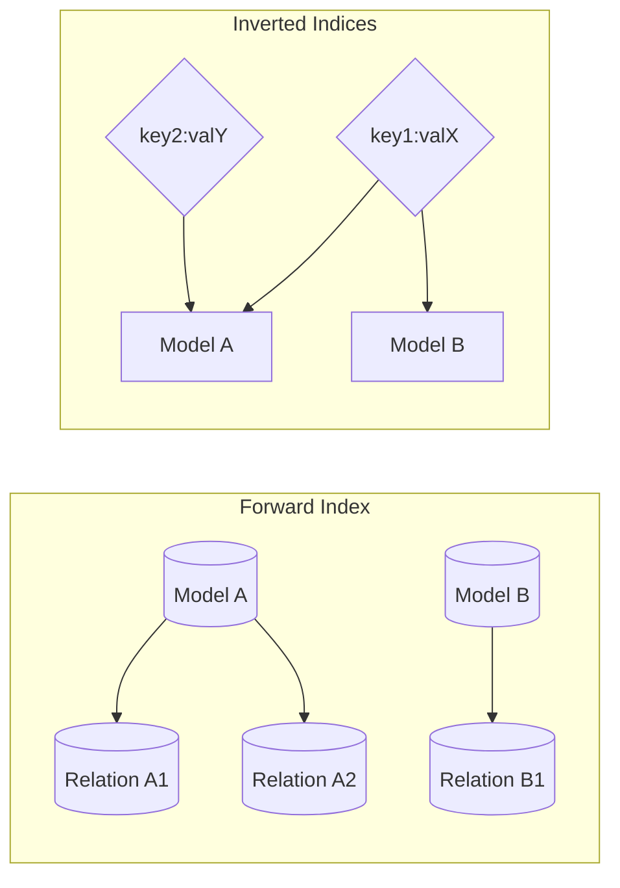
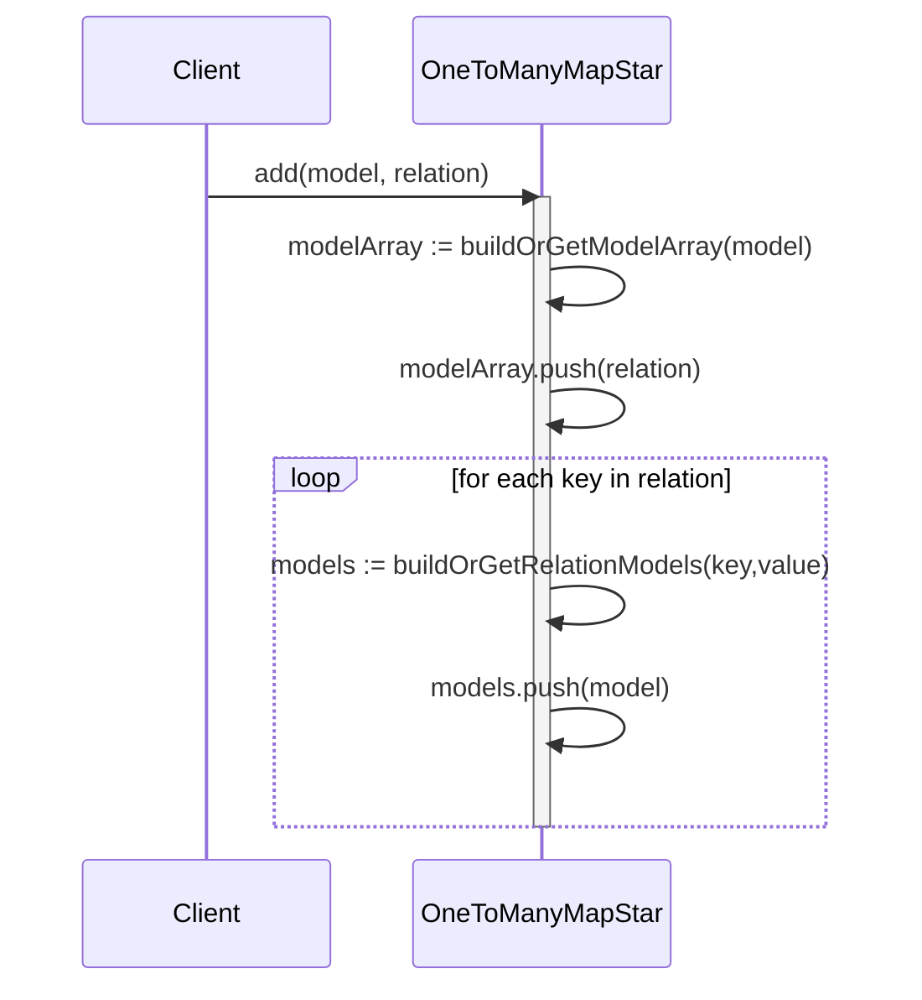
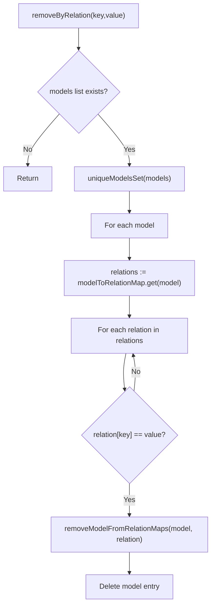
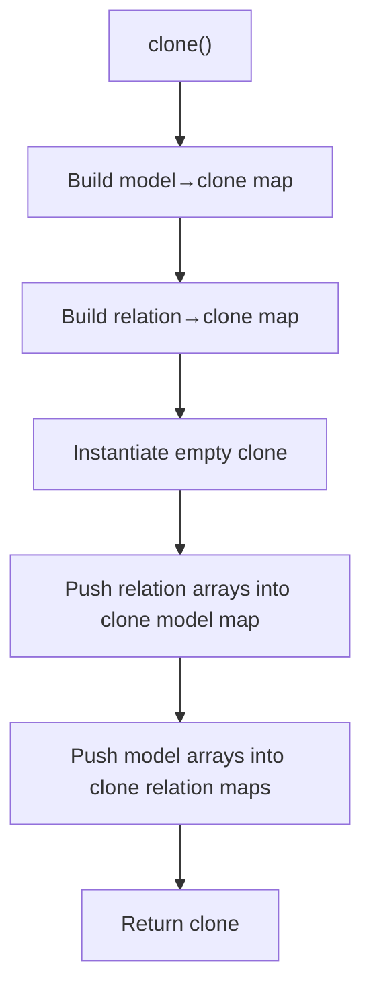

# `OneToManyMapStar`

A composite bidirectional multi-index data structure used internally to maintain fast lookups between a set of **models** and many different **relation properties** (a star of one-to-many projections). It supports:

- Forward index: `model -> relation[]` (all relation objects associated with the model)
- Inverted indices (one per relation key): `relationKeyValue -> model[]`
- Cloning with structural duplication control (overridable shallow/deep clone hooks)
- Targeted removal by relation key/value propagating consistency to all indices

Compared with naïve structures (e.g. `Map<K, Set<Model>>` per property plus ad-hoc reverse arrays) it centralizes consistency maintenance and offers predictable cloning hooks.

## Core Concepts

| Term | Meaning |
|------|---------|
| `TModel` | Arbitrary model object/value tracked in the structure |
| `TRelation` | Object whose (enumerated) properties form independent indices |
| `spec` | A specification object enumerating the subset of `TRelion` keys we index and whether each property is optional |
| Relation Entry | A concrete `TRelation` instance attached to a model |

## Data Model

Internal state (private fields):

```ts
#modelToRelationMap: Map<TModel, TRelation[]>;              // forward index
#relationToModelsMaps: { [K in keyof TRelation]-?: Map<TRelation[K], TModel[]> }; // inverted indices per key
#spec: OneToManyMapStartSpec<TRelation>;                    // configuration
```

### Specification Shape

```ts
type OneToManyMapStartSpec<TRelation extends object> = {
  [K in keyof TRelation]: { isOptional: undefined extends TRelation[K] ? true : false };
};
```

The spec drives which keys are indexed. Each key gets a dedicated `Map<value, TModel[]>`.

## High-Level Structure



Each relation object fan-outs to many property values; each property value fans back to multiple models → a star of indices.

## Operations Overview

| Operation | Goal | Complexity (k = relation keys, r = relations per model, m = models for key value) |
|-----------|------|----------------------------------------------------------------------------------|
| `add(model, relation)` | Insert relation and update all relevant indices | O(k) (array push + k Map lookups/creates) |
| `get(key, value)` | Retrieve models for a specific relation key value | O(1) expected (Map get) |
| `getAllKeys(key)` | Iterate all relation values stored for a key | O(1) to obtain iterator; iteration O(distinct values) |
| `removeByRelation(key, value)` | Remove every model that has at least one relation whose `key` equals `value` (and all its relations) | O(m * r * k) worst-case |
| `clone()` | Deep-ish structural copy with overridable element cloning | O(totalModels + totalRelations + totalKeyEntries) |

Notes:
- `removeByRelation` removes **all** relations for each affected model (not just those matching the (key,value) pair) because once a model is flagged by the key's value, the implementation purges its entire relation set (see Algorithm 4). This guarantees no dangling partial entries remain.
- Cloning uses indirection maps to ensure each model/relation is cloned exactly once then re-wired.

## Mermaid: Add Flow



## Mermaid: Removal by Relation Value



If any relation of a model matches `(key,value)`, the model is entirely purged from every inverted index tied to *all* of its relations.

## Mermaid: Clone Flow



## Algorithm 1: Add

```pseudocode
function add(model, relation): void
  // Forward index
  list := modelToRelationMap.get(model)
  if list == undefined
    list := []
    modelToRelationMap.set(model, list)
  list.push(relation)

  // Inverted indices per relation key present in relation
  for each key in ownKeys(relation)
    models := relationToModelsMaps[key].get(relation[key])
    if models == undefined
      models := []
      relationToModelsMaps[key].set(relation[key], models)
    models.push(model)
```

### Add Invariants
- A relation object is stored once in the model's forward array.
- For every enumerated key in the relation object, the model appears exactly once in the corresponding value bucket array.

## Algorithm 2: Get / Iterate Keys

```pseudocode
function get(key, value) -> Iterable<Model> | undefined
  return relationToModelsMaps[key].get(value)

function getAllKeys(key) -> Iterable<RelationKeyType>
  return relationToModelsMaps[key].keys()   // iterator over distinct values
```

## Algorithm 3: Clone

```pseudocode
function clone(): OneToManyMapStar
  modelCloneMap := new Map()
  for each model in modelToRelationMap.keys()
    modelCloneMap[model] := _cloneModel(model)

  relationCloneMap := new Map()
  for each relationsArray in modelToRelationMap.values()
    for each relation in relationsArray
      relationCloneMap[relation] := _cloneRelation(relation)

  clone := _buildNewInstance(spec)   // fresh empty structure

  // Rebuild forward index (model→relation[])
  for each (model, relationsArray) in modelToRelationMap
    clonedRelations := []
    for relation in relationsArray
      clonedRelations.push(relationCloneMap[relation])
    clone.#modelToRelationMap.set(modelCloneMap[model], clonedRelations)

  // Rebuild inverted indices
  for each key in spec.keys
    sourceMap := relationToModelsMaps[key]
    targetMap := clone.#relationToModelsMaps[key]
    for each (value, modelsArray) in sourceMap
      clonedModels := []
      for model in modelsArray
        clonedModels.push(modelCloneMap[model])
      targetMap.set(value, clonedModels)

  return clone
```

Hooks `_cloneModel` / `_cloneRelation` can be overridden (e.g., subclass performing deep copies). Default simply returns the same reference (shallow clone semantics).

## Algorithm 4: Remove By Relation

```pseudocode
function removeByRelation(key, value): void
  models := get(key, value)
  if models == undefined
    return
  uniqueModels := set(models)

  for each model in uniqueModels
    relations := modelToRelationMap.get(model)
    if relations == undefined
      error("Expecting model relation, none found")

    for each relation in relations
      if relation[key] == value
        // Remove model from EVERY key bucket for this relation
        for each relKey in ownKeys(relation)
          modelsBucket := relationToModelsMaps[relKey].get(relation[relKey])
          if modelsBucket != undefined
            removeOne(modelsBucket, model)
            if modelsBucket.length == 0
              relationToModelsMaps[relKey].delete(relation[relKey])
    modelToRelationMap.delete(model)
```

### Removal Properties
- Idempotent for the same `(key,value)` pair after first execution (subsequent calls become no-ops).
- Removes *all* relations for each affected model, ensuring no partial forward index remains for models that matched the filter.
- The use of a `Set` of models ensures we don't process the same model multiple times even if it appears several times in the bucket array.

## Edge Cases & Behaviors

| Scenario | Behavior |
|----------|----------|
| Add same model with multiple distinct relation objects | All are stored; inverted indices accumulate the model under each distinct (key,value) occurring across relations |
| Relation object missing a spec key | Not indexed for that key (only enumerated own keys are processed) |
| Optional relation key undefined | `undefined` can become a Map key (JS `Map` accepts it); maintained like any other value |
| Removing by non-existent value | Constant-time check; no mutation |
| Cloning after mutations | Snapshot reflects current state; further mutations don't affect clone due to separate `Map` & array instances |

## Complexity Discussion

- `add`: Dominated by per-key updates; arrays used instead of Sets to minimize allocation overhead (acceptable if duplicates per bucket are controlled by caller). If uniqueness per value is required externally, enforce before calling `add`.
- `removeByRelation`: Potentially expensive if the matching value is very popular. However, it guarantees global consistency without additional tracking structures.
- `clone`: Performs full duplication of arrays and top-level maps but not deep cloning of `model` / `relation` instances unless hooks are overridden.

## Usage Guidance

Use `OneToManyMapStar` when you need:
- Fast fan-out queries from a property value to all related models
- Symmetric, consistent removal across multiple indices
- Controlled cloning semantics for snapshotting caches or branching planning structures

Avoid it if:
- You need frequent removals of individual relation objects (not whole models) — the current removal granularity is model-wide once a relation matches.
- You require automatic deduplication inside each bucket (wrap adds with a presence check or switch arrays to Sets in a custom subclass).

## Potential Extensions (Not Implemented)

- Per-relation removal (removing a single relation object without purging the model) — would require tracking relation IDs or indices.
- Optional switch to `Set` for inverted index buckets to enforce uniqueness.
- Size metrics / counters for O(1) cardinality queries.
- Bulk operations (`addMany`, `removeMany`) to amortize internal lookups.

## Summary

`OneToManyMapStar` offers a pragmatic balance between functionality and performance for multi-key inverted indexing with cloning hooks. Its design favors:
- Simple O(1) point lookups
- O(k) insert path with minimal branching
- Deterministic full-model removal for consistency
- Customizable clone behavior for snapshotting complex dependency graphs.

By centralizing bidirectional maintenance, it reduces boilerplate and error surface when managing multi-property relationships in the container core.
