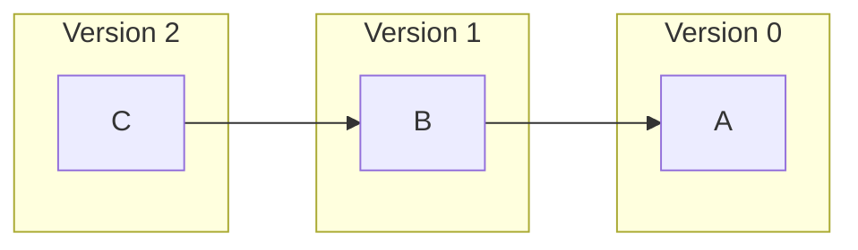
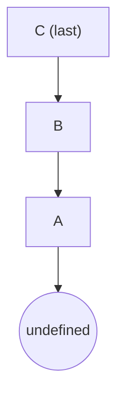
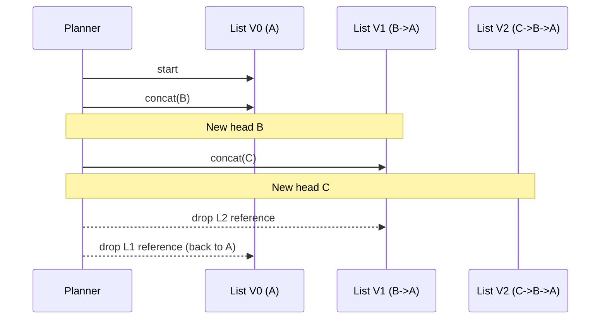

# `SingleImmutableLinkedList`

An ultra-lightweight, append-only, persistent (structurally shared) singly linked list used internally in the planning algorithms (see `planing.md`). It provides **O(1)** append (named `concat`) and cheap snapshots while preserving previous versions without cloning.

## When / Why We Use It

We frequently need to accumulate a *trail* (for example: constraint evaluation stack, ancestor metadata chain, parameter resolution path) while exploring or building plan trees. Typical operations:

- Add one new element (latest context) → produce a new list version
- Iterate from most recent element backwards to the oldest (LIFO style)

A classic mutable array would require copying to preserve previous snapshots. A standard JS array plus `push` and later `pop` is unsafe in async / nested explorations unless we carefully manage mutation. This tiny immutable list solves that with minimal GC overhead.

## Core Data Model

```ts
interface SingleImmutableLinkedListNode<T> {
  elem: T;                  // Stored value
  previous: SingleImmutableLinkedListNode<T> | undefined; // Older tail
}

class SingleImmutableLinkedList<T> implements Iterable<T> {
  constructor(public readonly last: SingleImmutableLinkedListNode<T>) {}
  concat(elem: T): SingleImmutableLinkedList<T> { /* O(1) */ }
  [Symbol.iterator](): Iterator<T> { /* walks last → … → first */ }
}
```

### Structural Sharing

`concat` allocates just **one** new node and points `previous` to the existing tail; older versions remain valid.

```
Version 0:   (A)
Version 1:   (B) -> (A)
Version 2:   (C) -> (B) -> (A)
```

Only the new head node is created each time.

## Graph: Shape & Growth



### Node Reference Chain



Iteration walks downward until `previous` is `undefined`.

## Algorithmic Operations

### Algorithm 1: Creating the Initial List

```pseudocode
function listCreate(elem): List
  node := { elem, previous: undefined }
  return new List(node)
```

### Algorithm 2: Append (Persistent) — `concat`

```pseudocode
function concat(list, elem): List
  newNode := { elem, previous: list.last }
  return new List(newNode)
```

- Time: O(1)
- Space (incremental): O(1) per new version
- Previous list remains intact (structural sharing)

### Algorithm 3: Iteration (Newest → Oldest)

```pseudocode
function iterator(list): Iterator
  node := list.last
  return {
    next: function(): { done, value }
      if node == undefined
        return { done: true, value: undefined }
      value := node.elem
      node := node.previous
      return { done: false, value }
  }
```

### Algorithm 4: Collect to Array (Utility Pattern)

(Not implemented in the class, but commonly useful.)

```pseudocode
function toArray(list): Array
  result := []
  for each value in list              // uses iterator above
    result.push(value)
  return result                       // Order: newest → oldest
```

If you need oldest → newest, reverse the array after collection.

## Complexity Summary

| Operation | Time | Extra Space | Notes |
|-----------|------|-------------|-------|
| `concat`  | O(1) | O(1)        | Single node allocation |
| Iterate n elems | O(n) | O(1) | Sequential traversal |
| Snapshot (reuse old version) | O(1) | 0 | Previous tail persists |

## Usage Patterns in Planning

In the planning system we often carry a context stack (e.g., ancestor metadata). Each time we descend into a dependency we `concat` the new frame. On unwind we simply drop the new reference and retain the previous list (no mutation or copying required).



This pattern avoids explicit pop operations and accidental mutation.

## Ordering Considerations

Iteration yields elements from newest to oldest. If a consumer needs chronological (oldest → newest) order, it can:

1. Collect to array and reverse.
2. Or build a second list while traversing (cost O(n)).

Keeping the default newest-first direction optimizes for the primary internal use case (looking at the most recent contexts first while checking constraints).

## Immutability Guarantees

- No operation mutates existing nodes.
- Garbage collection can reclaim any version that becomes unreachable.
- Thread/async safety (with respect to accidental shared mutation) is achieved without locks because state is never mutated in place.

## Comparison With Alternatives

| Approach | Append Snapshot Cost | Read Order | Mutation Risk | Notes |
|----------|---------------------|-----------|---------------|-------|
| JS Array + push/pop | O(1) but requires disciplined pop | Oldest → Newest | High (shared array) | Must copy for safe snapshots |
| JS Array + copy | O(n) | Oldest → Newest | Low | Expensive for long chains |
| This List | O(1) | Newest → Oldest | None | Ideal for stack-like traversal |

## Example (TypeScript)

```ts
const first = new SingleImmutableLinkedList({ elem: "A", previous: undefined });
const second = first.concat("B"); // B -> A
const third = second.concat("C"); // C -> B -> A

for (const x of third) {
  console.log(x); // C, then B, then A
}
```

## Potential Extensions (Not Implemented Intentionally)

- `size` field (would trade constant-time length for small per-node overhead). Kept out to minimize footprint.
- Oldest-first iterator (can be derived as shown above when required).
- Tail-sharing multi-branch structures (current design already supports branching via independent `concat` calls on historical versions).

## Edge Cases

| Scenario | Behavior |
|----------|----------|
| Iterating empty list? | Not represented directly; you always have at least one node (create a sentinel if needed). |
| Very deep chains | Linear iteration cost; acceptable for short/medium depth in planning. |
| Reusing nodes across async tasks | Safe: no mutation. |

If an actual empty sentinel is needed, create a wrapper abstraction (not part of this low-level primitive) that treats a `undefined` root as empty.

## Summary

`SingleImmutableLinkedList` is a minimal persistent stack optimized for: fast append, backward iteration, zero-copy snapshots, and predictable GC patterns—perfect for internal planning pipelines where ancestor context needs to be extended and reverted frequently without mutation complexity.
